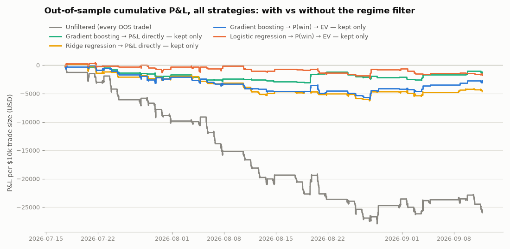

# Regime filters — learned from the journal, validated walk-forward

Generated 2026-09-12 · 60 sessions (2026-06-17 → 2026-09-11) ·
**walk-forward:** first 20 sessions train-only, then blocks of 5 sessions scored by a
model trained on every session before them · **40 out-of-sample sessions** · decision rule:
keep a trade when its predicted expected value is positive (classifiers: P(win)·avg_win +
(1−P(win))·avg_loss with averages from the training fold; regressors: predicted P&L) ·
"random same-size" = mean expectancy of 2,000 random subsets with the same trade count.

**Suggestive, not established.** The Gradient boosting → P&L directly filter lifts OOS expectancy from $-12.46 to $-4.09/trade, at the 94th percentile of same-size random selections — better than most random subsets, but not clearly enough to rule out chance, and still a losing book. Worth carrying into the paper loop as an advisory signal; not worth believing yet.

## Models

| model | OOS trades | kept | exp./trade, all | exp./trade, kept | PF all → kept | random same-size | pctile vs random |
|---|---|---|---|---|---|---|---|
| Gradient boosting → P&L directly | 2057 | 332 (16%) | $-12.46 | $-4.09 | 0.71 → 0.87 | $-12.44 | 94 |
| Ridge regression → P&L directly | 2057 | 597 (29%) | $-12.46 | $-7.80 | 0.71 → 0.78 | $-12.68 | 91 |
| Gradient boosting → P(win) → EV | 2057 | 325 (16%) | $-12.46 | $-9.00 | 0.71 → 0.83 | $-12.11 | 74 |
| Logistic regression → P(win) → EV | 2057 | 209 (10%) | $-12.46 | $-8.43 | 0.71 → 0.85 | $-12.56 | 73 |



*Read the curves with care: a filtered line holds fewer trades, so its total shrinks
mechanically even under random selection. The fair comparison is expectancy per
trade against the "random same-size" column, not the gap between the curves.*

## Calibration — does a higher predicted EV actually pay? (Gradient boosting → P&L directly)

| predicted-EV quintile | trades | mean predicted EV | actual exp./trade | win rate |
|---|---|---|---|---|
| 1 (lowest) | 412 | $-67.11 | $-19.34 | 33% |
| 2 | 411 | $-38.59 | $-17.98 | 34% |
| 3 | 411 | $-23.18 | $-10.91 | 37% |
| 4 | 411 | $-7.69 | $-9.37 | 43% |
| 5 (highest) | 412 | $+7.47 | $-4.70 | 47% |

A filter is only as good as this table is monotonic. If the top quintile does not
out-earn the bottom one out of sample, the model has learned to rank trades by
something other than what pays.

## Per strategy — Gradient boosting → P&L directly filter, out-of-sample only

| strategy | OOS trades | kept | exp./trade, all | exp./trade, kept | PF all → kept | P&L all → kept | random same-size | pctile vs random |
|---|---|---|---|---|---|---|---|---|
| Gap & Go | 10 | 2 (20%) ⚠ | $+83.88 | $+81.05 | 1.67 → 1.62 | $+838.84 → $+162.10 | $+87.28 | 47 |
| Opening Range Breakout | 216 | 29 (13%) | $-0.27 | $+58.80 | 1.00 → 2.26 | $-59.29 → $+1,705.28 | $-0.05 | 96 |
| VWAP Pullback | 294 | 7 (2%) ⚠ | $-19.71 | $-18.44 | 0.64 → 0.61 | $-5,793.80 → $-129.11 | $-19.90 | 54 |
| EMA 9/20 Crossover | 240 | 0 (0%) ⚠ | $-9.06 | — | 0.72 → — | $-2,174.85 → $+0.00 | — | — |
| RSI(2) Reversion | 487 | 224 (46%) | $-12.69 | $-13.89 | 0.43 → 0.45 | $-6,179.32 → $-3,111.57 | $-12.72 | 30 |
| News Momentum | 27 | 0 (0%) ⚠ | $-20.29 | — | 0.51 → — | $-547.91 → $+0.00 | — | — |
| Squeeze Breakout | 174 | 0 (0%) ⚠ | $-26.16 | — | 0.42 → — | $-4,552.42 → $+0.00 | — | — |
| High-Break ATR Trail | 175 | 9 (5%) ⚠ | $-25.59 | $-1.25 | 0.61 → 0.99 | $-4,478.88 → $-11.21 | $-24.52 | 72 |
| AR Forecast | 434 | 61 (14%) | $-6.17 | $+0.46 | 0.79 → 1.01 | $-2,677.40 → $+28.00 | $-6.15 | 80 |
| **All strategies** | 2057 | 332 (16%) | $-12.46 | $-4.09 | 0.71 → 0.87 | $-25,625.03 → $-1,356.51 | $-12.44 | 94 |

⚠ = fewer than 10 kept trades; noise, not evidence. "pctile vs random" is where
the filtered expectancy lands among 2,000 random subsets of the same size (≥95 = the selection
is doing something chance rarely does).

## Fold by fold — Gradient boosting → P&L directly

| fold | test sessions | train sessions | trades | kept | exp./trade, all | exp./trade, kept |
|---|---|---|---|---|---|---|
| 1 | 2026-07-17 → 2026-07-23 | 20 | 266 | 60 | $-15.81 | $-13.65 |
| 2 | 2026-07-24 → 2026-07-30 | 25 | 271 | 62 | $-17.15 | $-17.46 |
| 3 | 2026-07-31 → 2026-08-06 | 30 | 255 | 40 | $-19.50 | $-16.51 |
| 4 | 2026-08-07 → 2026-08-13 | 35 | 266 | 40 | $-23.29 | $-4.53 |
| 5 | 2026-08-14 → 2026-08-20 | 40 | 261 | 37 | $-10.09 | $+33.08 |
| 6 | 2026-08-21 → 2026-08-27 | 45 | 251 | 46 | $-16.06 | $-9.04 |
| 7 | 2026-08-28 → 2026-09-03 | 50 | 249 | 34 | $+11.44 | $+7.77 |
| 8 | 2026-09-04 → 2026-09-11 | 55 | 238 | 13 | $-7.52 | $+24.20 |

## What the filter looks at

Permutation importance measured on the decision that matters: how much OOS
filtered expectancy falls when one feature is shuffled in the test fold.

| feature | OOS expectancy drop when shuffled |
|---|---|
| aligned_trend_slope_pct | $+9.49 |
| mkt_gap_pct | $+7.20 |
| mkt_change_open_pct | $+1.62 |
| is_short | $+0.00 |
| aligned_spy_pct | $-0.22 |
| mkt_atr_pct | $-0.33 |
| weekday_num | $-0.38 |
| aligned_change_open_pct | $-0.52 |

Features prefixed `aligned_` are signed by trade direction (a short's SPY move is
negated), so one pooled model can treat "long in a rising tape" and "short in a
falling tape" as the same regime.

## Paper-journal check (real fills, different execution path)

A filter fitted only on backtest sessions before the paper loop's first fill
(2026-08-24) was applied to the **209 real paper trades** from
2026-08-24 to 2026-09-11. It kept 20; expectancy
$-39.39 → $-1.82/trade
(91st percentile vs same-size random selection). Small
sample — a direction check, not a verdict.

## Descriptive rules (in-sample, for reading — not evidence)

Depth-2 decision trees per strategy on the full window, so the filter's opinion is
legible. `weights: [losers, winners]` per leaf. These were fit on all sessions and
prove nothing; the walk-forward tables above are the evidence.

**Opening Range Breakout**

```
|--- mkt_change_open_pct <= 1.87
|   |--- mkt_atr_pct <= 0.92
|   |   |--- weights: [33.00, 41.00] class: 1
|   |--- mkt_atr_pct >  0.92
|   |   |--- weights: [111.00, 62.00] class: 0
|--- mkt_change_open_pct >  1.87
|   |--- aligned_range_pos <= 0.90
|   |   |--- weights: [9.00, 27.00] class: 1
|   |--- aligned_range_pos >  0.90
|   |   |--- weights: [20.00, 16.00] class: 0
```

**VWAP Pullback**

```
|--- mkt_realized_vol_pct <= 2.83
|   |--- mkt_range_pos <= 0.38
|   |   |--- weights: [25.00, 30.00] class: 1
|   |--- mkt_range_pos >  0.38
|   |   |--- weights: [55.00, 29.00] class: 0
|--- mkt_realized_vol_pct >  2.83
|   |--- aligned_change_open_pct <= 0.80
|   |   |--- weights: [81.00, 14.00] class: 0
|   |--- aligned_change_open_pct >  0.80
|   |   |--- weights: [129.00, 67.00] class: 0
```

**EMA 9/20 Crossover**

```
|--- aligned_change_open_pct <= -1.89
|   |--- weights: [6.00, 11.00] class: 1
|--- aligned_change_open_pct >  -1.89
|   |--- mkt_rel_volume <= 1.14
|   |   |--- weights: [234.00, 87.00] class: 0
|   |--- mkt_rel_volume >  1.14
|   |   |--- weights: [9.00, 12.00] class: 1
```

**RSI(2) Reversion**

```
|--- mkt_gap_pct <= 2.95
|   |--- aligned_spy_pct <= 0.56
|   |   |--- weights: [325.00, 263.00] class: 0
|   |--- aligned_spy_pct >  0.56
|   |   |--- weights: [19.00, 49.00] class: 1
|--- mkt_gap_pct >  2.95
|   |--- mkt_change_open_pct <= -1.39
|   |   |--- weights: [2.00, 21.00] class: 1
|   |--- mkt_change_open_pct >  -1.39
|   |   |--- weights: [20.00, 35.00] class: 1
```

**News Momentum**

```
|--- aligned_spy_pct <= 0.33
|   |--- weights: [12.00, 16.00] class: 1
|--- aligned_spy_pct >  0.33
|   |--- weights: [13.00, 3.00] class: 0
```

**Squeeze Breakout**

```
|--- mkt_gap_pct <= 0.92
|   |--- aligned_range_pos <= -0.04
|   |   |--- weights: [44.00, 22.00] class: 0
|   |--- aligned_range_pos >  -0.04
|   |   |--- weights: [102.00, 19.00] class: 0
|--- mkt_gap_pct >  0.92
|   |--- weekday_num <= 0.50
|   |   |--- weights: [6.00, 10.00] class: 1
|   |--- weekday_num >  0.50
|   |   |--- weights: [43.00, 18.00] class: 0
```

**High-Break ATR Trail**

```
|--- mkt_rel_volume <= 0.57
|   |--- mkt_spy_change_pct <= -0.12
|   |   |--- weights: [12.00, 3.00] class: 0
|   |--- mkt_spy_change_pct >  -0.12
|   |   |--- weights: [20.00, 0.00] class: 0
|--- mkt_rel_volume >  0.57
|   |--- aligned_range_pos <= 0.98
|   |   |--- weights: [125.00, 88.00] class: 0
|   |--- aligned_range_pos >  0.98
|   |   |--- weights: [20.00, 2.00] class: 0
```

**AR Forecast**

```
|--- mkt_change_open_pct <= 4.48
|   |--- mkt_change_open_pct <= 3.75
|   |   |--- weights: [328.00, 262.00] class: 0
|   |--- mkt_change_open_pct >  3.75
|   |   |--- weights: [18.00, 0.00] class: 0
|--- mkt_change_open_pct >  4.48
|   |--- aligned_spy_pct <= -0.07
|   |   |--- weights: [9.00, 8.00] class: 0
|   |--- aligned_spy_pct >  -0.07
|   |   |--- weights: [3.00, 23.00] class: 1
```


## The live filter

`regime_model.joblib` — Gradient boosting → P&L directly, fitted on all 60 sessions
(3083 trades). The paper scanner scores every base-strategy signal with it and
places a second order tagged `<strategy>_regime` only when predicted EV > 0, so
`paper_journal.csv` accumulates a live filtered-vs-unfiltered comparison; every journal row also
carries `regime_ev`, the filter's verdict at entry. Re-fitted each Saturday as the window rolls.

## How to read this honestly

- Every OOS number comes from a model that never saw the session it scored.
- A filter can only *remove* trades. If the entries have no edge in any regime,
  the best it can do is lose less — the "PF all → kept" column shows whether it
  found a subset that actually pays.
- With ~40 OOS sessions in one market regime, "gate met" here means *earned a
  paper-trading test*, not "trade it".
