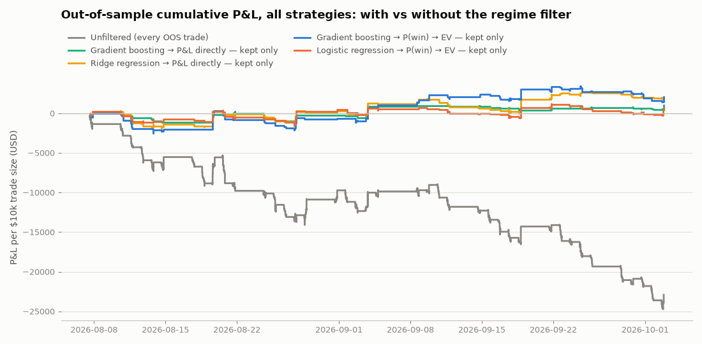

# Regime filters — learned from the journal, validated walk-forward

Generated 2026-10-03 · 60 sessions (2026-07-10 → 2026-10-02) ·
**walk-forward:** first 20 sessions train-only, then blocks of 5 sessions scored by a
model trained on every session before them · **40 out-of-sample sessions** · decision rule:
keep a trade when its predicted expected value is positive (classifiers: P(win)·avg_win +
(1−P(win))·avg_loss with averages from the training fold; regressors: predicted P&L) ·
"random same-size" = mean expectancy of 2,000 random subsets with the same trade count.

**Gate met on this window (pending paper confirmation).** The Gradient boosting → P&L directly filter's kept trades have positive out-of-sample expectancy ($+5.32/trade) and sit at the 99th percentile of same-size random selections — the model is selecting on regime, not luck.

## Models

| model | OOS trades | kept | exp./trade, all | exp./trade, kept | PF all → kept | random same-size | pctile vs random |
|---|---|---|---|---|---|---|---|
| Gradient boosting → P&L directly | 2023 | 191 (9%) | $-11.32 | $+5.32 | 0.71 → 1.16 | $-11.11 | 99 |
| Ridge regression → P&L directly | 2023 | 381 (19%) | $-11.32 | $+4.68 | 0.71 → 1.13 | $-11.33 | 100 |
| Gradient boosting → P(win) → EV | 2023 | 251 (12%) | $-11.32 | $+8.20 | 0.71 → 1.16 | $-11.35 | 100 |
| Logistic regression → P(win) → EV | 2023 | 156 (8%) | $-11.32 | $+4.10 | 0.71 → 1.06 | $-11.25 | 97 |



*Read the curves with care: a filtered line holds fewer trades, so its total shrinks
mechanically even under random selection. The fair comparison is expectancy per
trade against the "random same-size" column, not the gap between the curves.*

## Calibration — does a higher predicted EV actually pay? (Gradient boosting → P&L directly)

| predicted-EV quintile | trades | mean predicted EV | actual exp./trade | win rate |
|---|---|---|---|---|
| 1 (lowest) | 405 | $-64.79 | $-21.91 | 32% |
| 2 | 404 | $-37.48 | $-15.01 | 34% |
| 3 | 405 | $-25.29 | $-12.94 | 34% |
| 4 | 404 | $-10.89 | $-5.00 | 42% |
| 5 (highest) | 405 | $+4.38 | $-1.75 | 46% |

A filter is only as good as this table is monotonic. If the top quintile does not
out-earn the bottom one out of sample, the model has learned to rank trades by
something other than what pays.

## Per strategy — Gradient boosting → P&L directly filter, out-of-sample only

| strategy | OOS trades | kept | exp./trade, all | exp./trade, kept | PF all → kept | P&L all → kept | random same-size | pctile vs random |
|---|---|---|---|---|---|---|---|---|
| Gap & Go | 9 | 1 (11%) ⚠ | $+198.56 | $+424.16 | 5.47 → ∞ | $+1,787.03 → $+424.16 | $+208.82 | 78 |
| Opening Range Breakout | 201 | 28 (14%) | $+4.39 | $+38.15 | 1.06 → 1.48 | $+881.52 → $+1,068.08 | $+3.69 | 83 |
| VWAP Pullback | 300 | 0 (0%) ⚠ | $-23.92 | — | 0.56 → — | $-7,176.56 → $+0.00 | — | — |
| EMA 9/20 Crossover | 265 | 0 (0%) ⚠ | $-14.65 | — | 0.60 → — | $-3,883.06 → $+0.00 | — | — |
| RSI(2) Reversion | 465 | 118 (25%) | $-11.98 | $-8.60 | 0.40 → 0.56 | $-5,572.41 → $-1,014.82 | $-11.97 | 86 |
| News Momentum | 27 | 0 (0%) ⚠ | $-22.82 | — | 0.51 → — | $-616.23 → $+0.00 | — | — |
| Squeeze Breakout | 174 | 0 (0%) ⚠ | $-15.54 | — | 0.58 → — | $-2,703.37 → $+0.00 | — | — |
| High-Break ATR Trail | 168 | 5 (3%) ⚠ | $-20.76 | $+108.73 | 0.66 → 2.37 | $-3,487.00 → $+543.65 | $-19.06 | 97 |
| AR Forecast | 414 | 39 (9%) | $-5.17 | $-0.14 | 0.81 → 1.00 | $-2,139.00 → $-5.50 | $-4.78 | 69 |
| **All strategies** | 2023 | 191 (9%) | $-11.32 | $+5.32 | 0.71 → 1.16 | $-22,909.08 → $+1,015.57 | $-11.11 | 99 |

⚠ = fewer than 10 kept trades; noise, not evidence. "pctile vs random" is where
the filtered expectancy lands among 2,000 random subsets of the same size (≥95 = the selection
is doing something chance rarely does).

## Long vs short — side policies, out-of-sample only (Gradient boosting → P&L directly)

| book | trades | exp./trade | profit factor | P&L | pctile vs random same-size |
|---|---|---|---|---|---|
| Unfiltered, both sides | 2023 | $-11.32 | 0.71 | $-22,909.08 | — |
| Long only (unfiltered) | 1059 | $-12.80 | 0.70 | $-13,553.74 | 25 |
| Short only (unfiltered) | 964 | $-9.70 | 0.73 | $-9,355.34 | 75 |
| Filter on every trade (`_regime` variants) | 191 | $+5.32 | 1.16 | $+1,015.57 | 98 |
| Live policy: shorts unfiltered, longs only when EV > 0, orb exempt | 1170 | $-6.98 | 0.83 | $-8,166.32 | 99 |

The live paper scanner runs the last row (`long_gate="regime"`). "Long only" /
"Short only" answer whether one side alone carries the losses; the live policy
is only worth keeping if it beats the unfiltered book *and* sits well above
random same-size selection. Unlike the paper journal, these are backtest fills.

## Fold by fold — Gradient boosting → P&L directly

| fold | test sessions | train sessions | trades | kept | exp./trade, all | exp./trade, kept |
|---|---|---|---|---|---|---|
| 1 | 2026-08-07 → 2026-08-13 | 20 | 266 | 50 | $-23.29 | $-20.04 |
| 2 | 2026-08-14 → 2026-08-20 | 25 | 261 | 16 | $-10.09 | $+55.48 |
| 3 | 2026-08-21 → 2026-08-27 | 30 | 251 | 36 | $-16.06 | $-3.30 |
| 4 | 2026-08-28 → 2026-09-03 | 35 | 249 | 28 | $+11.44 | $+40.35 |
| 5 | 2026-09-04 → 2026-09-11 | 40 | 238 | 8 | $-7.52 | $-7.53 |
| 6 | 2026-09-14 → 2026-09-18 | 45 | 250 | 17 | $-9.94 | $-25.03 |
| 7 | 2026-09-21 → 2026-09-25 | 50 | 251 | 17 | $-20.11 | $+17.69 |
| 8 | 2026-09-28 → 2026-10-02 | 55 | 257 | 19 | $-13.91 | $+16.00 |

## What the filter looks at

Permutation importance measured on the decision that matters: how much OOS
filtered expectancy falls when one feature is shuffled in the test fold.

| feature | OOS expectancy drop when shuffled |
|---|---|
| aligned_trend_slope_pct | $+13.51 |
| mkt_autocorr_1 | $+1.46 |
| mkt_dist_vwap_pct | $+1.07 |
| mkt_rel_volume | $+0.88 |
| aligned_change_open_pct | $+0.75 |
| mkt_atr_pct | $+0.60 |
| is_short | $+0.00 |
| aligned_spy_pct | $-0.84 |

Features prefixed `aligned_` are signed by trade direction (a short's SPY move is
negated), so one pooled model can treat "long in a rising tape" and "short in a
falling tape" as the same regime.

## Paper-journal check (real fills, different execution path)

A filter fitted only on backtest sessions before the paper loop's first fill
(2026-08-24) was applied to the **608 real paper trades** from
2026-08-24 to 2026-10-02. It kept 54; expectancy
$-9.25 → $+43.49/trade
(100th percentile vs same-size random selection). Small
sample — a direction check, not a verdict.

## Descriptive rules (in-sample, for reading — not evidence)

Depth-2 decision trees per strategy on the full window, so the filter's opinion is
legible. `weights: [losers, winners]` per leaf. These were fit on all sessions and
prove nothing; the walk-forward tables above are the evidence.

**Opening Range Breakout**

```
|--- mkt_change_open_pct <= 1.96
|   |--- aligned_range_pos <= -0.13
|   |   |--- weights: [21.00, 30.00] class: 1
|   |--- aligned_range_pos >  -0.13
|   |   |--- weights: [132.00, 75.00] class: 0
|--- mkt_change_open_pct >  1.96
|   |--- aligned_range_pos <= 0.90
|   |   |--- weights: [3.00, 23.00] class: 1
|   |--- aligned_range_pos >  0.90
|   |   |--- weights: [15.00, 9.00] class: 0
```

**VWAP Pullback**

```
|--- mkt_atr_pct <= 0.54
|   |--- mkt_gap_pct <= -0.35
|   |   |--- weights: [38.00, 14.00] class: 0
|   |--- mkt_gap_pct >  -0.35
|   |   |--- weights: [47.00, 49.00] class: 1
|--- mkt_atr_pct >  0.54
|   |--- mkt_change_open_pct <= 2.24
|   |   |--- weights: [210.00, 67.00] class: 0
|   |--- mkt_change_open_pct >  2.24
|   |   |--- weights: [8.00, 11.00] class: 1
```

**EMA 9/20 Crossover**

```
|--- mkt_realized_vol_pct <= 4.40
|   |--- mkt_rel_volume <= 0.47
|   |   |--- weights: [81.00, 42.00] class: 0
|   |--- mkt_rel_volume >  0.47
|   |   |--- weights: [173.00, 44.00] class: 0
|--- mkt_realized_vol_pct >  4.40
|   |--- mkt_rel_volume <= 0.45
|   |   |--- weights: [15.00, 6.00] class: 0
|   |--- mkt_rel_volume >  0.45
|   |   |--- weights: [7.00, 15.00] class: 1
```

**RSI(2) Reversion**

```
|--- mkt_realized_vol_pct <= 1.45
|   |--- aligned_change_open_pct <= 0.59
|   |   |--- weights: [12.00, 6.00] class: 0
|   |--- aligned_change_open_pct >  0.59
|   |   |--- weights: [27.00, 1.00] class: 0
|--- mkt_realized_vol_pct >  1.45
|   |--- aligned_spy_pct <= 0.45
|   |   |--- weights: [312.00, 268.00] class: 0
|   |--- aligned_spy_pct >  0.45
|   |   |--- weights: [29.00, 62.00] class: 1
```

**News Momentum**

```
|--- mkt_autocorr_1 <= 0.00
|   |--- weights: [22.00, 5.00] class: 0
|--- mkt_autocorr_1 >  0.00
|   |--- weights: [8.00, 9.00] class: 1
```

**Squeeze Breakout**

```
|--- mkt_gap_pct <= 0.86
|   |--- mkt_change_open_pct <= 3.82
|   |   |--- weights: [111.00, 37.00] class: 0
|   |--- mkt_change_open_pct >  3.82
|   |   |--- weights: [24.00, 0.00] class: 0
|--- mkt_gap_pct >  0.86
|   |--- mkt_spy_change_pct <= -0.12
|   |   |--- weights: [15.00, 22.00] class: 1
|   |--- mkt_spy_change_pct >  -0.12
|   |   |--- weights: [37.00, 13.00] class: 0
```

**High-Break ATR Trail**

```
|--- aligned_spy_pct <= -0.18
|   |--- mkt_gap_pct <= 0.74
|   |   |--- weights: [9.00, 6.00] class: 0
|   |--- mkt_gap_pct >  0.74
|   |   |--- weights: [3.00, 12.00] class: 1
|--- aligned_spy_pct >  -0.18
|   |--- mkt_gap_pct <= -1.15
|   |   |--- weights: [53.00, 7.00] class: 0
|   |--- mkt_gap_pct >  -1.15
|   |   |--- weights: [114.00, 58.00] class: 0
```

**AR Forecast**

```
|--- aligned_change_open_pct <= 5.06
|   |--- mkt_rel_volume <= 0.36
|   |   |--- weights: [49.00, 16.00] class: 0
|   |--- mkt_rel_volume >  0.36
|   |   |--- weights: [300.00, 249.00] class: 0
|--- aligned_change_open_pct >  5.06
|   |--- weights: [2.00, 13.00] class: 1
```


## The live filter

`regime_model.joblib` — Gradient boosting → P&L directly, fitted on all 60 sessions
(3057 trades). The paper scanner scores every base-strategy signal with it and
places a second order tagged `<strategy>_regime` only when predicted EV > 0, so
`paper_journal.csv` accumulates a live filtered-vs-unfiltered comparison; every journal row also
carries `regime_ev`, the filter's verdict at entry. Re-fitted each Saturday as the window rolls.

## How to read this honestly

- Every OOS number comes from a model that never saw the session it scored.
- A filter can only *remove* trades. If the entries have no edge in any regime,
  the best it can do is lose less — the "PF all → kept" column shows whether it
  found a subset that actually pays.
- With ~40 OOS sessions in one market regime, "gate met" here means *earned a
  paper-trading test*, not "trade it".
