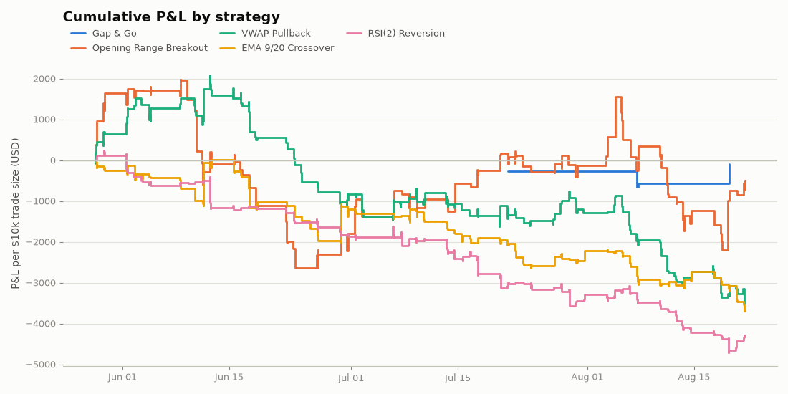

# Backtest results

Generated 2026-08-23 · window **2026-05-28 → 2026-08-21** ·
symbols **TSLA, NVDA, AMD, PLTR, COIN, MSTR** · bars **5m** ·
**$10,000** per trade · slippage **5 bps/side** ·
long-only, everything flat by 15:55 ET.

## Ranking (by win rate)

| strategy | trades | win_rate_pct | avg_win | avg_loss | profit_factor | expectancy | total_pnl | max_drawdown | median_hold_min |
|---|---|---|---|---|---|---|---|---|---|
| RSI(2) Reversion | 396 | 52.0 | 23.12 | -47.72 | 0.53 | -10.87 | -4303.63 | -4938.7 | 15.0 |
| Gap & Go | 4 | 50.0 | 286.85 | -331.13 | 0.87 | -22.14 | -88.56 | -400.2 | 290.0 |
| Opening Range Breakout | 179 | 46.9 | 191.85 | -176.16 | 0.96 | -3.47 | -620.51 | -4614.89 | 330.0 |
| VWAP Pullback | 246 | 34.6 | 124.14 | -87.43 | 0.75 | -14.33 | -3524.37 | -5611.0 | 50.0 |
| EMA 9/20 Crossover | 240 | 27.5 | 89.67 | -54.89 | 0.62 | -15.14 | -3633.17 | -3703.42 | 58.0 |

Win rate alone doesn't pay — a high-win-rate strategy with avg losses larger than
avg wins can still lose money. Read it together with **profit_factor** (gross
wins / gross losses, >1 is profitable) and **expectancy** (avg $ per trade).

## How each strategy's trades ended (% of trades)

| strategy | eod | signal | stop | target |
|---|---|---|---|---|
| EMA 9/20 Crossover | 19.6 | 59.2 | 21.2 | 0.0 |
| Gap & Go | 50.0 | 0.0 | 50.0 | 0.0 |
| Opening Range Breakout | 67.0 | 0.0 | 25.7 | 7.3 |
| RSI(2) Reversion | 0.0 | 84.8 | 15.2 | 0.0 |
| VWAP Pullback | 17.9 | 0.0 | 60.6 | 21.5 |

`stop` = protective stop hit · `target` = fixed take-profit hit ·
`signal` = strategy's own exit rule · `eod` = flattened at the session cutoff.

Full trade-by-trade log: [trades.csv](trades.csv).

*Small sample (yfinance caps 5-minute history at 60 days), one market regime,
liquid large caps rather than true low-float gappers — see the README's
limitations section before reading anything into these numbers.*
