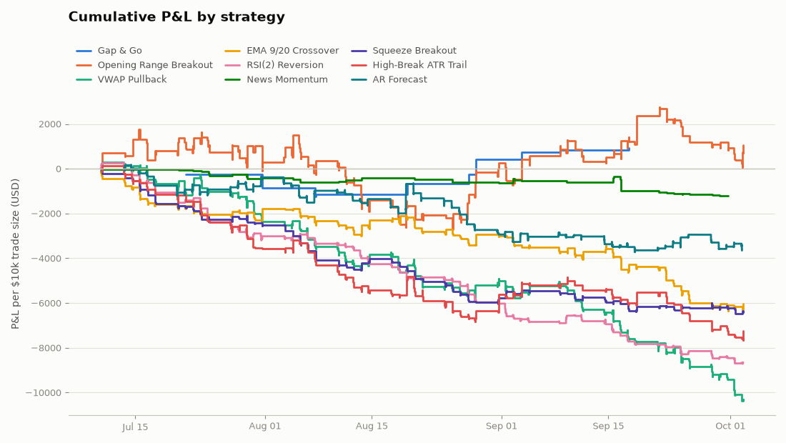

# Backtest results

Generated 2026-10-10 · window **2026-07-17 → 2026-10-09** ·
symbols **TSLA, NVDA, AMD, PLTR, COIN, MSTR** · bars **5m** ·
**$10,000** per trade · slippage **5 bps/side** ·
**1637 long / 1421 short**, everything flat by 15:55 ET.

## Ranking (by win rate)

| strategy | trades | win_rate_pct | avg_win | avg_loss | profit_factor | expectancy | total_pnl | max_drawdown | median_hold_min |
|---|---|---|---|---|---|---|---|---|---|
| Gap & Go | 12 | 66.7 | 273.4 | -322.98 | 1.69 | 74.61 | 895.32 | -1000.63 | 332.0 |
| RSI(2) Reversion | 716 | 46.5 | 19.02 | -38.58 | 0.43 | -11.79 | -8444.34 | -8504.86 | 15.0 |
| AR Forecast | 621 | 43.5 | 48.27 | -47.32 | 0.78 | -5.76 | -3575.28 | -3875.05 | 20.0 |
| Opening Range Breakout | 307 | 42.3 | 184.58 | -142.61 | 0.95 | -4.06 | -1245.41 | -4221.52 | 340.0 |
| News Momentum | 49 | 32.7 | 71.21 | -69.72 | 0.5 | -23.7 | -1161.48 | -1493.73 | 60.0 |
| High-Break ATR Trail | 260 | 31.5 | 115.36 | -93.66 | 0.57 | -27.74 | -7212.13 | -7343.63 | 145.0 |
| VWAP Pullback | 443 | 31.4 | 106.11 | -78.88 | 0.62 | -20.84 | -9230.15 | -10529.53 | 60.0 |
| EMA 9/20 Crossover | 385 | 28.8 | 79.17 | -47.83 | 0.67 | -11.21 | -4316.92 | -4689.41 | 65.0 |
| Squeeze Breakout | 265 | 28.7 | 68.26 | -57.56 | 0.48 | -21.48 | -5691.79 | -5698.91 | 50.0 |

Win rate alone doesn't pay — a high-win-rate strategy with avg losses larger than
avg wins can still lose money. Read it together with **profit_factor** (gross
wins / gross losses, >1 is profitable) and **expectancy** (avg $ per trade).

## How each strategy's trades ended (% of trades)

| strategy | eod | signal | stop | target |
|---|---|---|---|---|
| AR Forecast | 0.0 | 88.4 | 11.6 | 0.0 |
| EMA 9/20 Crossover | 23.1 | 57.4 | 19.5 | 0.0 |
| Gap & Go | 75.0 | 0.0 | 25.0 | 0.0 |
| High-Break ATR Trail | 31.5 | 0.0 | 68.5 | 0.0 |
| News Momentum | 40.8 | 0.0 | 44.9 | 14.3 |
| Opening Range Breakout | 69.7 | 0.0 | 24.4 | 5.9 |
| RSI(2) Reversion | 0.6 | 86.6 | 12.8 | 0.0 |
| Squeeze Breakout | 29.1 | 0.0 | 58.5 | 12.5 |
| VWAP Pullback | 21.7 | 0.0 | 60.5 | 17.8 |

`stop` = protective stop hit · `target` = fixed take-profit hit ·
`signal` = strategy's own exit rule · `eod` = flattened at the session cutoff.

## Long vs short, per strategy

| strategy | long trades | long exp./trade | short trades | short exp./trade |
|---|---|---|---|---|
| Gap & Go | 8 | $+106.15 | 4 | $+11.52 |
| Opening Range Breakout | 165 | $-0.96 | 142 | $-7.65 |
| VWAP Pullback | 232 | $-22.57 | 211 | $-18.92 |
| EMA 9/20 Crossover | 199 | $-20.79 | 186 | $-0.96 |
| RSI(2) Reversion | 369 | $-11.62 | 347 | $-11.98 |
| News Momentum | 25 | $-45.21 | 24 | $-1.30 |
| Squeeze Breakout | 154 | $-24.13 | 111 | $-17.80 |
| High-Break ATR Trail | 136 | $-13.04 | 124 | $-43.86 |
| AR Forecast | 349 | $-5.96 | 272 | $-5.50 |

Each side read as its own book. The walk-forward version of this question — with
the live long-gate policy scored against random selection — is in REGIME.md.

Full trade-by-trade log: [trades.csv](trades.csv).

*Small sample (yfinance caps 5-minute history at 60 days), one market regime,
liquid large caps rather than true low-float gappers — see the README's
limitations section before reading anything into these numbers.*
