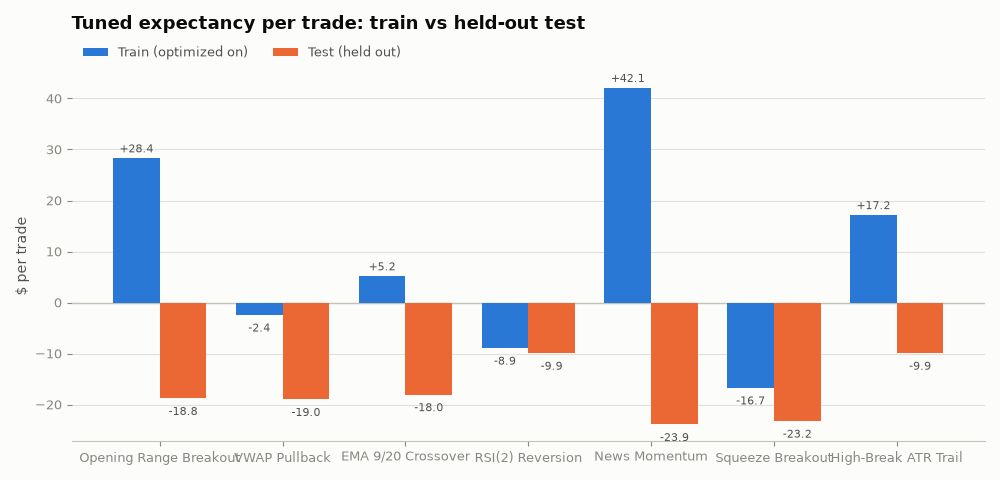

# Parameter tuning — train/test split

Generated 2026-08-23 · optimized on the first **36 sessions**
(before 2026-07-21), validated on the held-out **24 sessions** · objective:
**expectancy per trade** (never win rate — see v0.1) · parameter sets with fewer
than 20 train trades are discarded as noise.

| strategy | best params (train) | train exp./trade | test exp./trade | test exp. (defaults) | test trades | test win rate | test P&L |
|---|---|---|---|---|---|---|---|
| Gap & Go | n/a (too few trades) | — | — | $-22.14 | 4 | — | — |
| Opening Range Breakout | {'range_bars': 6, 'target_r': 1.5, 'stop_at_mid': False} | $+28.35 | $-18.78 | $-10.60 | 61 | 39.3% | $-1,146 |
| VWAP Pullback | {'target_r': 2.0, 'stop_buffer': 0.995} | $-2.41 | $-18.97 | $-24.13 | 93 | 37.6% | $-1,764 |
| EMA 9/20 Crossover | {'fast': 5, 'slow': 13, 'stop_bars': 5} | $+5.23 | $-18.03 | $-16.16 | 149 | 21.5% | $-2,687 |
| RSI(2) Reversion | {'entry_level': 15.0, 'exit_level': 70.0, 'stop_pct': 0.005} | $-8.91 | $-9.90 | $-7.50 | 231 | 47.2% | $-2,287 |
| News Momentum | {'window_min': 30, 'vol_mult': 1.2, 'target_r': 3.0} | $+42.15 | $-23.89 | $-20.45 | 21 | 33.3% | $-502 |
| Squeeze Breakout | {'bw_lookback': 6, 'target_r': 1.5} | $-16.71 | $-23.22 | $-34.35 | 86 | 31.4% | $-1,997 |
| High-Break ATR Trail | {'window_bars': 6, 'trail_atr_mult': 1.5} | $+17.22 | $-9.90 | $-19.92 | 73 | 35.6% | $-722 |

## How to read this

- **train → test shrinkage is the overfitting, made visible.** Parameters that
  look best in-sample routinely give most of it back out-of-sample; the gap
  between the two columns is the honest measure of how much the grid search
  just memorized.
- **"test exp. (defaults)"** is the untuned textbook strategy on the same
  held-out sessions — the bar tuning has to beat to claim any value.
- With ~24 test sessions this is still a small sample; treat survivors as
  candidates for paper trading, not conclusions.
