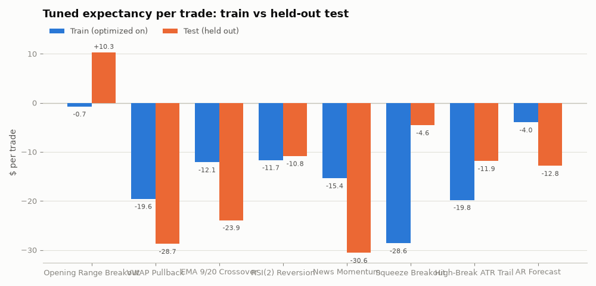

# Parameter tuning — train/test split

Generated 2026-10-10 · optimized on the first **36 sessions**
(before 2026-09-08), validated on the held-out **24 sessions** · objective:
**expectancy per trade** (never win rate — see v0.1) · parameter sets with fewer
than 20 train trades are discarded as noise.

| strategy | best params (train) | train exp./trade | test exp./trade | test exp. (defaults) | test trades | test win rate | test P&L |
|---|---|---|---|---|---|---|---|
| Gap & Go | n/a (too few trades) | — | — | $+98.11 | 2 | — | — |
| Opening Range Breakout | {'range_bars': 3, 'target_r': 2.0, 'stop_at_mid': False} | $+1.51 | $-13.62 | $-13.62 | 113 | 37.2% | $-1,539 |
| VWAP Pullback | {'target_r': 1.5, 'stop_buffer': 0.995} | $-14.99 | $-31.65 | $-27.88 | 155 | 33.5% | $-4,905 |
| EMA 9/20 Crossover | {'fast': 9, 'slow': 20, 'stop_bars': 5} | $-9.24 | $-13.54 | $-13.54 | 177 | 27.7% | $-2,396 |
| RSI(2) Reversion | {'entry_level': 15.0, 'exit_level': 50.0, 'stop_pct': 0.005} | $-11.99 | $-8.21 | $-8.66 | 387 | 42.4% | $-3,176 |
| News Momentum | {'window_min': 60, 'vol_mult': 1.2, 'target_r': 1.5} | $-19.40 | $-14.49 | $-14.46 | 52 | 34.6% | $-753 |
| Squeeze Breakout | {'bw_lookback': 12, 'target_r': 1.5} | $-18.61 | $-11.01 | $-12.52 | 111 | 36.9% | $-1,222 |
| High-Break ATR Trail | {'window_bars': 6, 'trail_atr_mult': 1.5} | $-15.03 | $-20.62 | $-29.51 | 121 | 32.2% | $-2,495 |
| AR Forecast | {'lags': 12, 'horizon': 6, 'threshold': 0.002} | $-1.59 | $-6.44 | $-5.24 | 202 | 42.6% | $-1,300 |

## How to read this

- **train → test shrinkage is the overfitting, made visible.** Parameters that
  look best in-sample routinely give most of it back out-of-sample; the gap
  between the two columns is the honest measure of how much the grid search
  just memorized.
- **"test exp. (defaults)"** is the untuned textbook strategy on the same
  held-out sessions — the bar tuning has to beat to claim any value.
- With ~24 test sessions this is still a small sample; treat survivors as
  candidates for paper trading, not conclusions.

## Live promotion (survivor gate)

A tuned set trades live as `<strategy>_tuned` only once it has been the grid's
winner with **identical parameters** and has **beaten the defaults on the held-out
split** in each of the last 3 weekly runs. Everything else keeps
trading on defaults only.

| strategy | live | why |
|---|---|---|
| Opening Range Breakout | held back | did not beat the defaults on held-out data in all 3 runs |
| VWAP Pullback | held back | best parameters changed within the last 3 runs |
| EMA 9/20 Crossover | held back | best parameters changed within the last 3 runs |
| RSI(2) Reversion | held back | best parameters changed within the last 3 runs |
| News Momentum | held back | best parameters changed within the last 3 runs |
| Squeeze Breakout | held back | did not beat the defaults on held-out data in all 3 runs |
| High-Break ATR Trail | held back | best parameters changed within the last 3 runs |
| AR Forecast | held back | best parameters changed within the last 3 runs |

Consecutive runs share most of their 60-day window, so passing shows the result
*persists*, not that it's independently confirmed — the live `_tuned` vs default
comparison in the paper journal is the real test.
